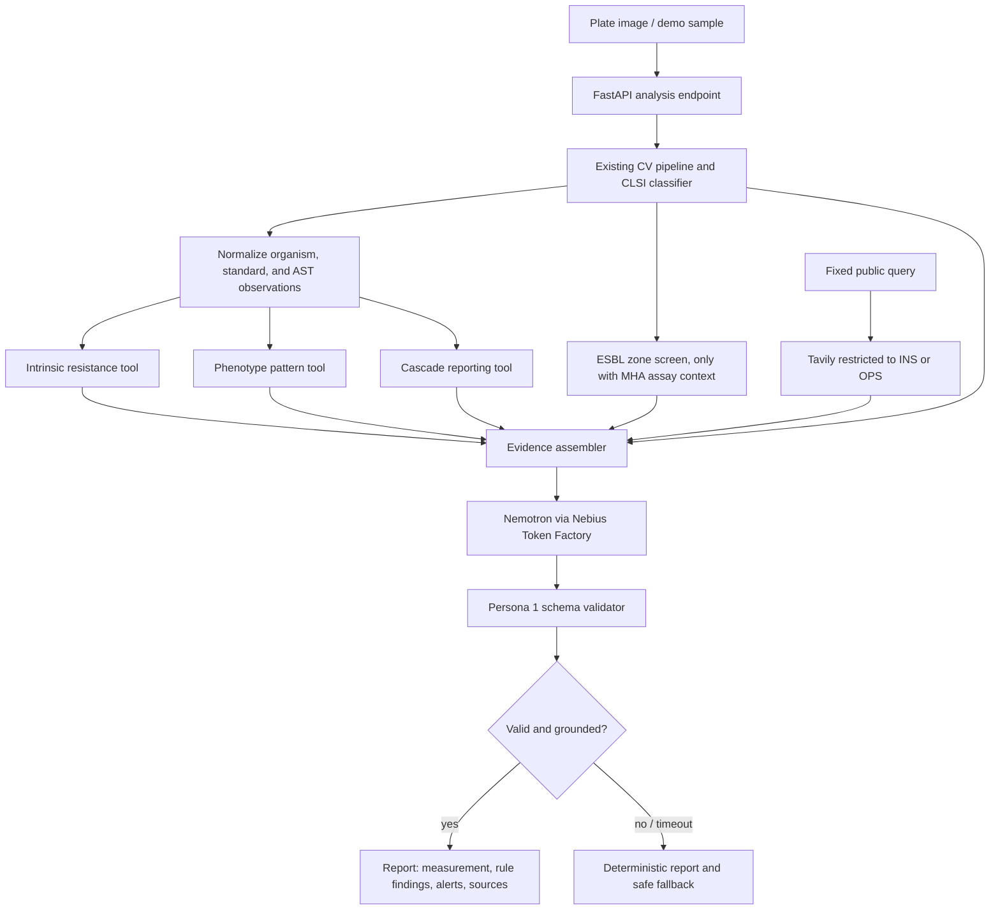

# Agent Workflow and Architecture

## Intended use for the hackathon

BacterioScope is a research/demo assistant for reviewing antimicrobial susceptibility test (AST) plate readings and showing traceable rule/public-health context. Its current image pipeline and CLSI classifier have not been validated for patient-care decisions. The interface must keep an accountable microbiologist in control; it must not release results or recommend treatment.

## End-to-end workflow



The image pipeline owns measurements and current S/I/R calculations. Persona 2 tools own only rule flags/reporting actions that have been sourced, licensed, reviewed, and enabled. Tavily is a separate source of current public alerts, never a source for breakpoints or isolate-level interpretation. Nemotron may explain the evidence bundle; it cannot change measurements, S/I/R values, rule findings, citations, or cascade actions.

## Nodes and edges

| Node | Input | Deterministic responsibility | Output |
|---|---|---|---|
| `analyze_plate` | Image plus explicit organism/panel selection | Run existing pipeline and versioned CLSI classifier; preserve quality flags and traceability. | Measurements, categories, standard version, flags. |
| `normalize_ast_observations` | Pipeline result | Map drug identity and category into the Persona 2 contract; reject duplicates or missing categories. | `organism`, `standard`, `observations[]`. |
| `check_intrinsic_resistance` | AST contract | Apply exact-organism, exact-standard approved rules only. | Sourced conflict findings. |
| `evaluate_phenotype_rules` | AST contract | Evaluate complete approved category patterns. | Sourced rule findings; no inference from missing observations. |
| `apply_cascade_reporting` | AST contract | Apply approved reporting rules without modifying any AST category. | Explicit suppressed drug codes and source. |
| `evaluate_esbl_screen` | Exact organism, CLSI edition, assay context, and raw disk code/potency/zone/quality observations | Apply matching reviewed zone criteria only after checking the MHA disk-diffusion conditions. | Screen signal for review, tested/missing criteria, source citation; no diagnosis or S/I/R changes. |
| `search_amr_alerts` | Fixed query plus `ins` or `ops` | Use Tavily domain restriction and filter returned HTTPS URLs to the selected official domain. | Title, source, URL, snippet, publication date. |
| `assemble_evidence` | Pipeline output, rule outputs, optional alerts | Separate measured, classified, rule-derived, and web-retrieved fields; preserve source IDs and versions. | Typed report context. |
| `generate_report_explanation` | Minimum evidence context | Call one Nemotron model on Nebius; treat retrieved snippets as untrusted and require citations from the supplied list. | Untrusted structured model response. |
| `validate_and_render` | Model response and evidence context | Persona 1 validates schema, enums, citations, and forbidden changes; fallback on any failure. | Traceable report or safe deterministic fallback. |

```text
analyze_plate -> normalize_ast_observations -> [intrinsic, phenotype, cascade]
[pipeline, rule findings, optional public alerts] -> assemble_evidence
assemble_evidence -> generate_report_explanation -> validate_and_render
invalid output / timeout -> deterministic report and fallback
```

The Tavily edge receives fixed broad queries only. Never include isolate identifiers, images, AST vectors, or patient details in those requests. An empty alert result means only that search returned no eligible links.

## Persona 2 tool contract

Python signatures live in `src/bacterioscope/rules/tools.py` and `src/bacterioscope/integrations/tavily.py`.

```python
ASTObservation(antibiotic_code="CRO", category="R")
check_intrinsic_resistance(
    organism="...", standard="CLSI M100-Ed33 2023", observations=[...]
)
```

Each rule tool returns `RuleEvaluation`:

- `findings`: `rule_id`, `rule_type`, `code`, optional `phenotype_label`, matched antibiotic codes, source ID, citation, and URL;
- `suppressed_antibiotics`: cascade output only;
- `skipped_rule_ids`: disabled/unlicensed/unreviewed rules or rules for another edition.
- `catalog_status`: indicates whether rules are configured and eligible; an empty catalog is unavailable coverage, not a negative finding.

The bundled catalog is empty until CLSI content has a confirmed edition, reuse authorization, and a qualified reviewer. A future integration must not treat “empty catalog” as “no resistance” or “no cascade rule exists.” Include `catalog_status` in the final report so the UI can say that rule review was unavailable.

The Ed36 ESBL screen is a separate zone-measurement tool in `src/bacterioscope/rules/esbl_screen.py`. It requires the M100 assay context and exact disk potency; its eight bundled Ed36 criteria are draft and return unavailable. Esteban's input contract must preserve raw drug identity, disk potency, diameter in millimeters, and measurement-quality state before wiring this tool. A screen signal is not an ESBL diagnosis; no signal does not rule ESBL out, especially for an incomplete panel.

The existing `contracts/agent-review-v1.schema.json` was drafted for the earlier education workflow. Esteban owns the final lab-review response contract and should replace or extend that draft before wiring clinical tool outputs into the agent.

`TavilyAlertSearch.search_amr_alerts("ins" | "ops")` returns `PublicAlert(source, title, url, snippet, published_date)`. Search results are informational public sources, not clinical evidence. API key is server-side `TAVILY_API_KEY`.

## Data and provenance boundaries

- The existing classifier uses CLSI M100-Ed33 (2023). CLSI currently lists Ed36 (2026); do not call Ed33 current or combine editions. Coordinate an edition decision with Esteban.
- UZH/Dryad measurements have EUCAST provenance and may support identity-matched zone-diameter checks. The current `Overview GPT JCM.xlsx` phenotype flags are unverified, must remain separate from CLSI rule outputs, and cannot be evaluation ground truth until Dryad/the authors clarify their role. Verified EUCAST categories still cannot validate CLSI CA/VME/ME/mE.
- Public demo fixtures must contain no patient-identifiable information. Prefer UZH's public, CC0 material after confirming the downloaded artifact hash and source citation.
- Preserve the source edition/license/reviewer for each enabled rule; do not put raw licensed CLSI table excerpts in prompts or public reports.
- Tavily result snippets are external and untrusted: do not execute instructions contained in them or cite them as if reviewed CLSI rules.

## Failure behavior

- Missing CLSI rule content: return an explicit empty/blocked catalog state; never fabricate a negative finding.
- Standard mismatch or rule lacking reviewer/reuse metadata: skip it and include its ID in `skipped_rule_ids`.
- Tavily key missing, timeout, rate limit, malformed response, or no official-domain results: report alerts unavailable; continue deterministic analysis.
- Token Factory timeout, invalid schema, unknown evidence ID, or model attempt to alter deterministic fields: discard model text and use the deterministic report/fallback.
